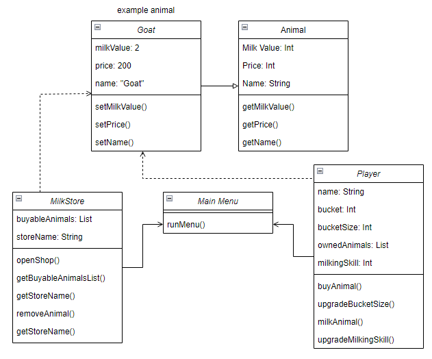

## Project - Milk Factory
#### Design
Initial drawn design, image below.

Low res version until Jarl provides a higher res version.

### Bulletpoints
Bulletpoints are randomly assorted, aka. not according to priority

1. Buy an animal
2. Milk the animal
3. Sell the milk
4. Upgrade manual milking
5. Purchase auto milkers
6. Check animal status

### Class diagram

